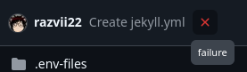

# Bakery Wiki Skeleton
---
The highly opinionated, infinitely less configurable, good out of the box fork of [Git-Wiki-Theme](https://github.com/Drassil/git-wiki-theme).

# Getting started
---
## Initial deployment
### Creating the repo
First, you need to click "Use this template" at the top right, and choose "Create a new repository".  
  
This will let you create a repository based on the skeleton repo, name it, and give Github a minute or two to copy the files over.
### Github pages
When you clone the skeleton repository, it will immediately try to deploy to the Github Pages page of that repo, this will initially fail.  
  
This is because there is currently no github page set up for that repository.

Navigate over to your repository settings.   
Navigate over to the "Pages" section and under "Build and Development" you will find the "source" dropdown, where you will choose "Github actions".

### Redeploy the site 
You can now navigate over to the "Actions" tab, and under "Deploy Jekyll site to Pages" you can click on "Run workflow" to rerun the deployment step.
  
This will take about a minute or two.
You can also simply make another commit to the repository to trigger the build and deploy steps.

### Verify
Navigate to your pages url under `https://username.github.io/repo` to verify that your site is compiled correctly.
You may also want to set your website URL to your pages url:  
  
so it's easily accesible.
If everything compiled correctly, you should see this exact file rendered as the index of your site! If so, you can move on to the next step, if not, please open an issue at https://github.com/razvii22/bakery-wiki-skeleton/issues/new and I will do my best to help.

## Setup
Navigate to your new repository's `config.yml` file, you will want to configure this a bit.
### Repo url
The first thing you should change is the github repository url:  
  
We will probably go back to using jekyll-github-metadata at some point but this is good for local testing.
### Branch
You can also change the repository branch, but if you are using the skeleton repository, you don't need to.
### Title
The title is currently unused, but this may change at any time, your wiki syncs up to [bakery-wiki-theme](https://github.com/razvii22/bakery-wiki-theme) so upstream changes apply when your site gets rebuilt.
### Commit
You can commit the new config file to your repository, and the biggest change you should notice is that the top right side edit buttons now function correctly.

## Configuration
Bakery wiki theme offers `some` customisability, we're not monsters... not all of us anyway!
### Nav buttons
  
You can add entries to this mapping following standard YAML syntax, this will add additional navigation buttons to the top left of your wiki pages such as the "Home" button, you can use this to also remove the home button if you wish.
The urls are relative to the baseurl variable, however the Jekyll action overrides this variable, rendering it useless.

# Using the Wiki
You can add your markdown pages to the `wiki/` directory, your blog posts to `_posts/` and other miscellaneous files anywhere, depending on how you want the site tree to be rendered.
Refer to [the theme repo](https://github.com/razvii22/bakery-wiki-theme) or to its [web documentation](https://razvii22.github.io/bakery-wiki-theme/wiki/testpage.html) for further documentation about the formatting and special components supported.
You can also refer to [Jekyll documentation](https://jekyllrb.com/docs/) and Drassil's [theme](https://github.com/Drassil/git-wiki-theme) for further documentation and formatting help.